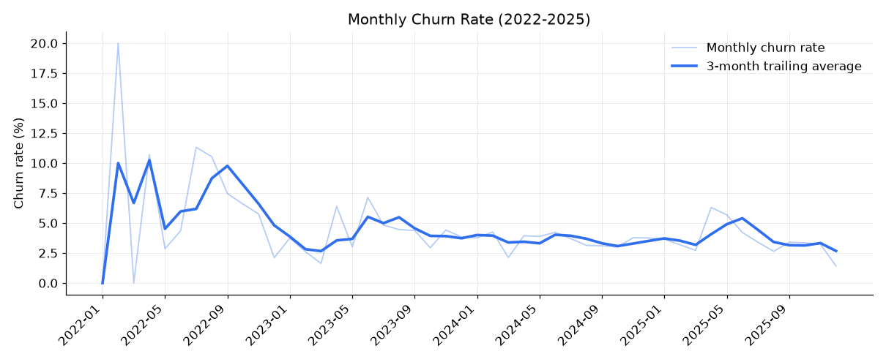
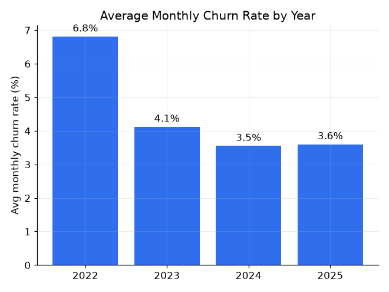
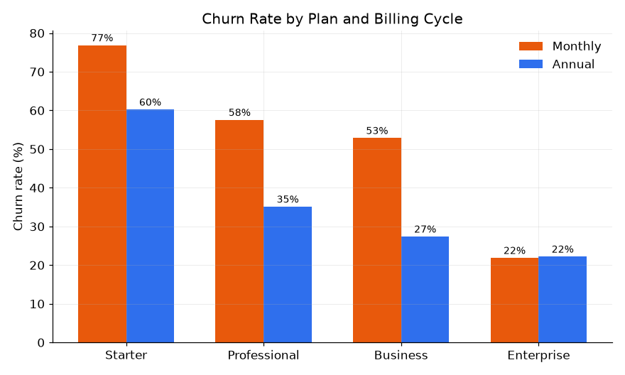
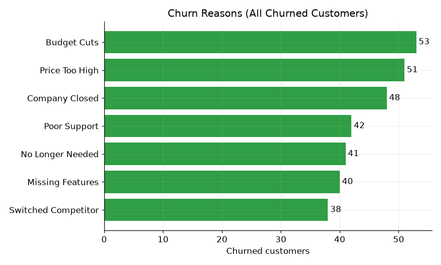
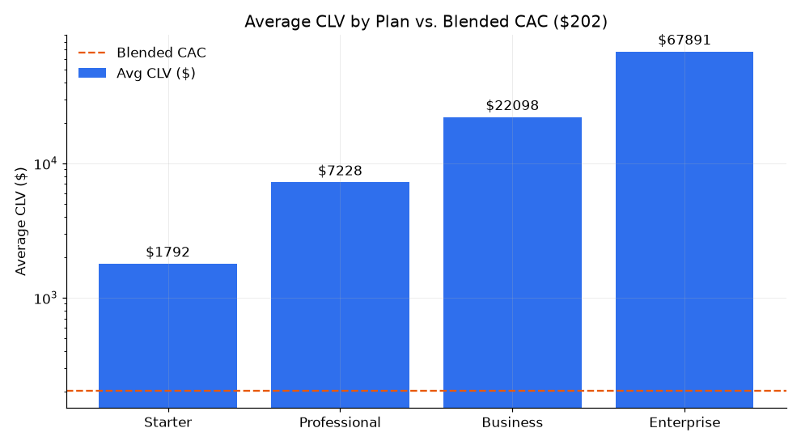
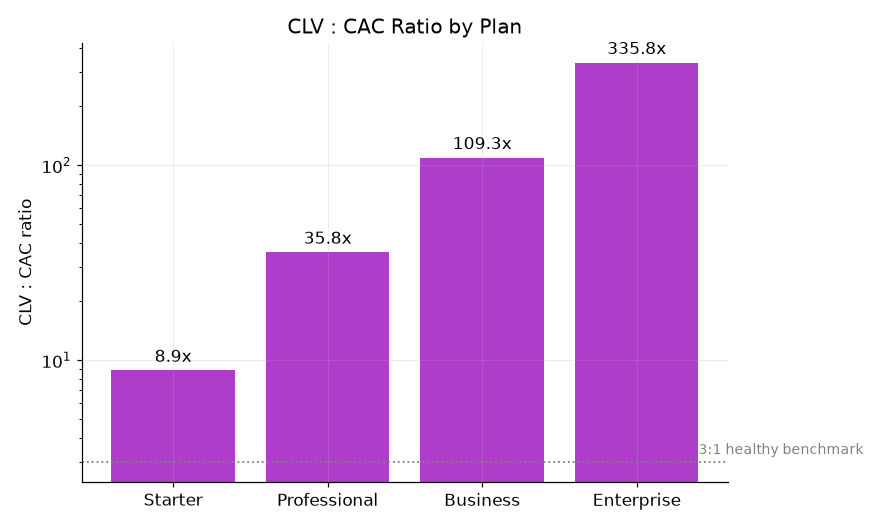
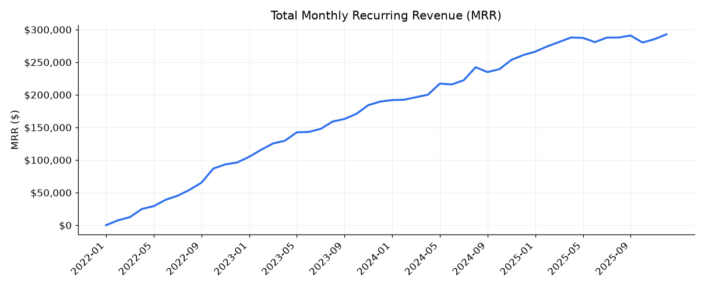
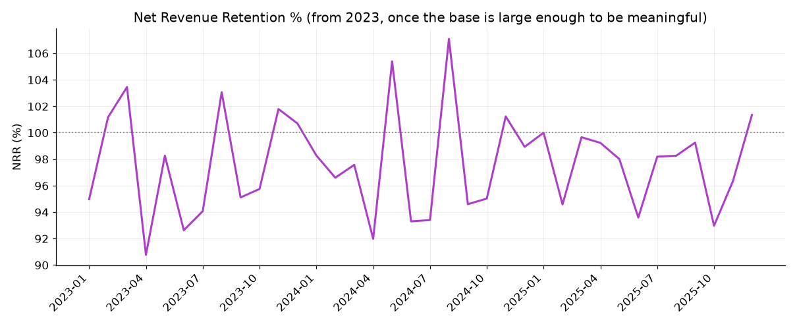
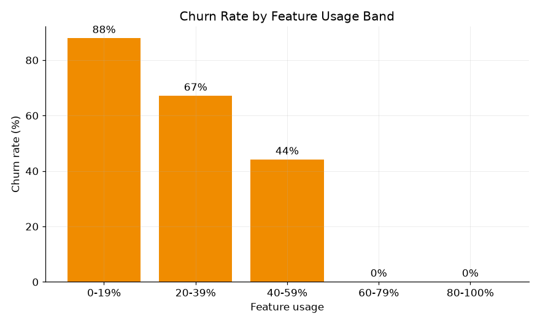

# CloudTask Pro — Churn & Unit Economics Analysis

CloudTask Pro is a SaaS company that grew from 0 to 600 customers between January 2022 and
December 2025. The board is worried about churn, and the CFO asked for three things: where churn
is concentrated, why customers are leaving, and whether the unit economics (CLV vs. CAC) actually
hold up. This project answers all three from a subscription-level dataset (600 customers) and a
monthly company summary (48 months), using SQL for the analysis and a Power BI model on top of it
for reporting.

## Dataset

- `data/subscriptions.csv` — one row per customer: plan, billing cycle, industry, company size,
  seats, MRR, acquisition channel, region, signup date, churn status/date/reason, support tickets,
  NPS score, feature usage %, and whether they ever upgraded.
- `data/monthly_revenue.csv` — one row per month (Jan 2022–Dec 2025): active customers, new
  customers, churned customers, monthly churn rate, total MRR, ARPU, and CAC.

Both files reconcile exactly (600 signups and 313 churns in `subscriptions.csv` match the sums of
`new_customers` and `churned_customers` in `monthly_revenue.csv`), and the data quality checks in
`sql/02_data_quality_checks.sql` turned up no missing values, no duplicate customer IDs, and no
inconsistent category labels. That's worth stating plainly rather than skipping past it — this
dataset didn't need the cleaning a lot of real exports do, so the SQL below goes straight from
audit to analysis.

## Workflow

1. **Load & audit** — schema, null checks, category value checks, and a cross-check between the
   two files (`sql/01_schema_and_cleaning.sql`, `sql/02_data_quality_checks.sql`).
2. **Churn rate & trend** — overall churn rate, the monthly trend since 2022, and which months
   moved the most (`sql/03_churn_rate_trend.sql`).
3. **Churn by segment** — plan, billing cycle, acquisition channel, company size, and the riskiest
   plan × company-size combinations (`sql/04_churn_by_segment.sql`).
4. **Churn reasons** — top reasons overall and how they shift by plan and company size
   (`sql/05_churn_reasons.sql`).
5. **Unit economics** — CLV by plan, blended CAC, and the CLV:CAC ratio (`sql/06_unit_economics.sql`).
6. **Revenue retention** — monthly MRR, net new MRR, NRR%, and flagged spike/dip months
   (`sql/07_revenue_retention.sql`).
7. **At-risk customers** — the feature-usage/NPS relationship to churn, a threshold definition,
   and the current at-risk list (`sql/08_at_risk_customers.sql`).
8. **Reporting layer** — a Power BI star schema, DAX measures, and Power Query cleaning steps
   built on top of the same two tables (`powerbi/`), plus an Excel companion workbook
   (`analysis/CloudTask_Pro_Churn_Summary.xlsx`) with the same numbers as live formulas for
   anyone who wants to sanity-check a figure without opening a SQL client.

Every number quoted below came directly out of running the `.sql` files in this repo against a
local SQLite build of the two CSVs (`sql/load_db.py`) — none of it was estimated by hand.

## Findings

### 1. Overall churn rate and trend

Lifetime churn rate across all 600 customers who have ever signed up is **52.2%** (313
churned). That number on its own is scary but misleading for a 4-year-old company, since it
includes customers who signed up and churned back in 2022 under very different retention
conditions. The monthly trend tells the more useful story:

| Year | Avg. monthly churn rate |
|---|---|
| 2022 | 6.81% |
| 2023 | 4.12% |
| 2024 | 3.55% |
| 2025 | 3.60% |

**Churn improved sharply from 2022 through 2024**, then flattened out in 2025 rather than
continuing to fall. Two months stand out: April and May 2025 spiked to 6.3% and 5.7%, well above
the surrounding trend — worth a closer look at what happened in that cohort (see the chart below;
nothing in this dataset points to a single obvious cause, which itself is a reasonable thing to
flag back to the business rather than force an explanation the data doesn't support).




### 2. Highest-risk segments: plan and billing cycle

| Plan | Churn rate |
|---|---|
| Starter | **70.5%** |
| Professional | 48.0% |
| Business | 41.3% |
| Enterprise | 22.0% |

Churn drops steadily as plan tier goes up — Starter churns at more than 3x the rate of Enterprise.

Billing cycle matters just as much: **monthly billing churns at 60.5% vs. 40.3% for annual** —
a 20-point gap. That gap holds within every plan except Enterprise, where monthly and annual churn
are nearly identical (21.9% vs. 22.2%) — Enterprise customers are Enterprise customers regardless
of billing cycle, but for every other plan, getting a customer onto annual billing is one of the
single best retention levers available.



Acquisition channel and company size also move the needle, though less dramatically:
**Referral has the highest channel churn (61.3%)**, which runs against the usual assumption that
referred customers are stickier — worth a second look at how referrals are being sourced and
qualified rather than assuming the channel itself is healthy just because it's referral traffic.
Direct Sales churns least (39.3%). Company size shows a mild U-shape: the smallest (1-10 seats,
56.7%) and largest (500+, 63.2%) accounts churn more than the mid-market (51-200, 42.6%).

### 3. Top churn reasons

| Reason | Share of all churn |
|---|---|
| Budget Cuts | 16.9% |
| Price Too High | 16.3% |
| Company Closed | 15.3% |

These three alone account for about half of all churn, and **Budget Cuts + Price Too High
together (33.2%) mark this as substantially a price-sensitivity problem**, not primarily a
product one. That story changes by plan, though:

- **Starter and Professional** churn mostly on price (`Price Too High` / `Budget Cuts` are tied
  for the #1 reason on both plans).
- **Business's** top reason is `Missing Features` — a product-gap problem rather than a pricing
  one, meaning the fix for Business-tier churn probably isn't a discount.
- **Enterprise** churns least overall, and what little churn it has splits between
  `Company Closed` and `No Longer Needed` — factors outside CloudTask Pro's control, which lines
  up with Enterprise being the healthiest segment on every other metric too.



### 4. CLV vs. CAC by plan

Blended CAC across all channels and months is **$202.20** (weighted by how many customers were
actually acquired each month, not a plain average of the monthly CAC figures).

| Plan | Avg. MRR | Avg. lifespan (months) | Avg. CLV | CLV:CAC ratio |
|---|---|---|---|---|
| Starter | $215.54 | 8.3 | $1,792 | 8.9x |
| Professional | $497.04 | 14.5 | $7,228 | 35.8x |
| Business | $1,303.64 | 17.0 | $22,098 | 109.3x |
| Enterprise | $2,984.99 | 22.7 | $67,891 | 335.8x |




Two things worth being upfront about:

- **CAC here is a single company-wide blended number**, not one broken out by plan — the source
  data only tracks one CAC figure per month, not by plan or channel. So this comparison answers
  "is each plan's CLV healthy against what the company spends to acquire a customer on average,"
  not "is Starter's CAC efficient relative to Starter's own acquisition spend." A true per-plan
  read would need acquisition spend attributed at the plan level, which isn't in this dataset.
- **CLV lifespan uses each customer's tenure to date**, capped at the reporting snapshot for
  customers who haven't churned yet. Enterprise is 78% still-active, so its true CLV is almost
  certainly higher than $67,891 once those customers eventually do churn; Starter is only 29.5%
  still-active, so its $1,792 figure is closer to a realized number. (`sql/06_unit_economics.sql`
  includes a churned-customers-only version of this calculation as a sensitivity check.)

Every plan clears the standard 3:1 healthy-ratio bar comfortably, because CAC is small relative to
plan MRR across the board. That means **Starter's problem isn't CAC efficiency — it's that a
short 8.3-month average lifespan and low $215 ARPU cap how much any single Starter customer is
ever worth**, which is exactly why its 70.5% churn rate matters more in dollar terms than the
CLV:CAC ratio alone would suggest.

### 5. Revenue retention

Total MRR grew from $0 to **$292,629** by December 2025. Net new MRR (new MRR added minus MRR
lost to churn that month) was positive in all but a handful of months — April 2025, May 2025, and
September 2025 were the exceptions, each coinciding with a churned-MRR spike rather than a
new-business slowdown.



Net Revenue Retention — measured properly here as (this month's MRR minus this month's new MRR) ÷
last month's MRR, which isolates what happened to the *existing* customer base — is noisy in 2022
while the revenue base is still tiny, then settles into a **~85–107% range from 2023 onward,
averaging 97.7%**. Sitting just under 100% means the existing base is shrinking slightly before
new business is added back in — consistent with the plan-level churn story above, and a useful
number for the CFO because it separates "are we retaining what we have" from "are we still
growing" (the answer to the second question is clearly yes; the first is a slight net negative).



### 6. At-risk customers

This is the strongest signal in the whole dataset. Splitting customers into feature-usage bands:

| Feature usage | Churn rate |
|---|---|
| 0–19% | 87.9% |
| 20–39% | 67.1% |
| 40–59% | 44.1% |
| 60–79% | 0.0% |
| 80–100% | 0.0% |



**Not one customer with 60%+ feature usage has ever churned**, and the same is true on the NPS
side — every single churned customer was a detractor (NPS ≤ 6); no passive or promoter has
churned. Average feature usage for churned customers (27.5%) is roughly half that of active
customers (55.0%), and it's paired with lower NPS (3.0 vs. 5.8) and more support tickets (7.4 vs.
5.5 over 12 months).

Using the churned population's own profile to set the cutoff rather than picking a round number
arbitrarily (the 60th percentile of churned customers' usage lands at 30%), the at-risk definition
here is **feature usage below 30% AND NPS of 6 or lower**. Applied to the currently active base:

- **23 active customers (8.0% of the active base) are at risk**, representing **$17,918 in MRR**.
- At-risk share is fairly even across plans (Starter 9.4%, Business 8.5%, Enterprise 7.7%,
  Professional 6.7%) — this isn't a plan-specific problem, it's a product-engagement problem that
  cuts across the whole customer base.

The full list of the 23 at-risk customers (ID, plan, MRR, NPS, usage) is in the **At-Risk
Customers** tab of the Excel workbook, ready to hand to the customer success team.

## Recommendations

1. **Push monthly-billing customers toward annual contracts**, especially on Starter and
   Professional, where the retention gap between billing cycles is largest.
2. **Treat Starter as a lifespan/engagement problem, not a CAC problem** — CAC is not the
   constraint; getting customers past the ~30% feature-usage threshold in their first few months
   is, given how cleanly usage predicts churn.
3. **Investigate Business-tier churn as a product gap** (`Missing Features` is its #1 reason),
   separately from the pricing-driven churn on Starter/Professional — a discount won't fix this
   segment.
4. **Re-evaluate the Referral channel's sourcing/qualification** — it has the highest churn rate
   of any acquisition channel, which is unusual and worth understanding before scaling referral
   spend further.
5. **Route the 23 flagged at-risk accounts ($17.9K MRR) to customer success now** — the
   usage/NPS combination has a perfect track record as a leading indicator in this dataset.

## Tech stack and how to reproduce

- **SQL** (`sql/`) — SQLite locally (`python3 sql/load_db.py` builds `cloudtask_pro.db` from the
  two CSVs), but written close to standard SQL; only date-part extraction
  (`strftime`) and window-function syntax would need adjusting for Postgres/MySQL.
- **Power BI** (`powerbi/`) — star-schema data model, Power Query cleaning steps, and the full DAX
  measure list needed to rebuild the report. Power BI Desktop is Windows-only and wasn't available
  in the environment this was built in, so there's no `.pbix` file — static recreations of each
  page's core visual (built from the same query outputs) are the PNGs referenced above, and
  `powerbi/data_model.md` describes the report page layout in full.
- **Excel** (`analysis/CloudTask_Pro_Churn_Summary.xlsx`) — a companion workbook with the raw
  data and every summary table above rebuilt as live COUNTIFS/SUMIFS/AVERAGEIFS formulas, not
  pasted-in numbers, so it recalculates if the source data changes.

```bash
cd cloudtask-pro-churn-analysis
python3 sql/load_db.py                 # builds cloudtask_pro.db from the two CSVs
# then run any file in sql/ against cloudtask_pro.db with your SQLite client of choice
```

## Project structure

```
cloudtask-pro-churn-analysis/
├── README.md
├── data/
│   ├── subscriptions.csv
│   └── monthly_revenue.csv
├── sql/
│   ├── load_db.py
│   ├── 01_schema_and_cleaning.sql
│   ├── 02_data_quality_checks.sql
│   ├── 03_churn_rate_trend.sql
│   ├── 04_churn_by_segment.sql
│   ├── 05_churn_reasons.sql
│   ├── 06_unit_economics.sql
│   ├── 07_revenue_retention.sql
│   └── 08_at_risk_customers.sql
├── powerbi/
│   ├── data_model.md
│   ├── power_query_steps.md
│   └── dax_measures.txt
└── analysis/
    ├── CloudTask_Pro_Churn_Summary.xlsx
    ├── query_results/          (CSV exports of every query above)
    └── charts/                 (PNG chart previews referenced in this README)
```
