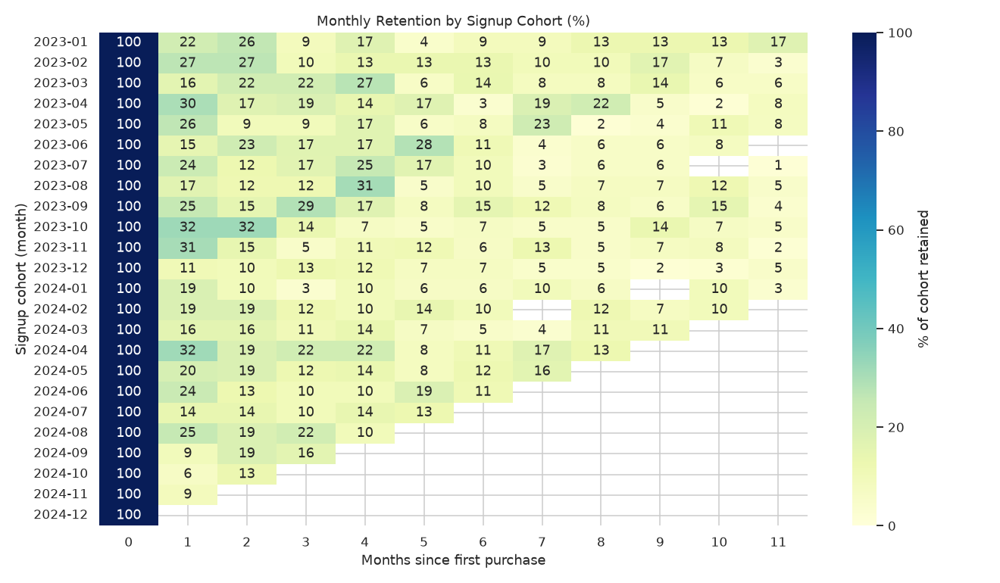
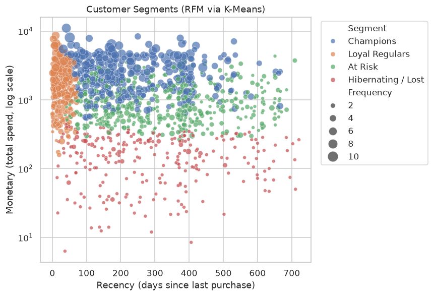

# Customer Segmentation & Retention Analysis

An intermediate-level data analysis project on a synthetic e-commerce transactions dataset: clean a
messy raw export, explore sales trends, engineer RFM features, segment customers with K-Means, measure
cohort retention, and run a hypothesis test comparing acquisition channels.

**[Open the full notebook →](notebooks/customer_segmentation_analysis.ipynb)**

## Why this dataset

The transactions are synthetically generated (`src/generate_data.py`) rather than downloaded, so the
project is fully reproducible with no external dependency, but they're generated with real-world
structure baked in on purpose:

- seasonal demand (holiday spike in Nov/Dec)
- 1,800 customers across 5 acquisition channels, each with a latent "loyalty" trait that drives realistic,
  varied churn
- deliberately messy: missing customer IDs, missing/outlier prices, duplicate rows, returns
  (negative quantities), and inconsistent country strings (`"UK"`, `"united kingdom"`, `"United Kingdom"`, ...)

That mess matters — cleaning it is most of what makes this an *intermediate* rather than a toy exercise.

## What's in the notebook

| Step | Technique |
|---|---|
| 1. Data audit | `.isna()`, `.duplicated()`, distribution checks to find the problems before fixing anything |
| 2. Cleaning | de-duplication, text standardization, per-category outlier capping, median imputation, separating sales from returns |
| 3. EDA | monthly revenue trend, revenue by category, order-value distribution |
| 4. Customer segmentation | RFM (Recency/Frequency/Monetary) feature engineering → log-transform + scale → K-Means (elbow method to pick *k*) → segments labeled by composite rank, not arbitrary cluster IDs |
| 5. Cohort analysis | monthly cohort retention table + heatmap, average retention curve |
| 6. Hypothesis testing | Mann-Whitney U test comparing order value across acquisition channels (non-parametric, since order values are right-skewed) + per-channel retention curves |
| 7. Export | customer segment table written to `outputs/rfm_segments.csv` |

## Key results (from this run)

- Revenue is strongly seasonal, peaking in Nov/Dec.
- K-Means (k=4, chosen via the elbow method) separates customers into **Champions**, **Loyal
  Regulars**, **At Risk**, and **Hibernating/Lost** segments with clearly different average
  spend and purchase frequency (see the notebook's segment profile table).
- Retention drops off sharply in the first 1-2 months after a customer's first purchase across nearly
  every signup cohort, then flattens into a smaller repeat-buyer base — see the cohort heatmap below.
- Order value did **not** differ significantly between Referral and Paid Ads customers
  (Mann-Whitney U test, p ≈ 0.89) — in this data, acquisition channel shows up in *retention*, not in
  how much a customer spends per order. That distinction (checked explicitly with the per-channel
  retention curves) is the kind of thing a purely descriptive average-order-value comparison would miss.

<p align="center">
  
</p>
<p align="center">
  
</p>

**Caveat:** the dataset is synthetic, generated to exercise this methodology (not to model a real
business), so treat the specific numbers as illustrative rather than benchmarks — the pipeline and
techniques are the point.

## Project structure

```
customer-segmentation-analysis/
├── README.md
├── requirements.txt
├── src/
│   └── generate_data.py              # builds the synthetic raw dataset
├── data/
│   └── raw/
│       └── transactions.csv          # generated output (committed for reproducibility)
├── notebooks/
│   └── customer_segmentation_analysis.ipynb   # the full analysis, pre-executed
└── outputs/
    ├── rfm_segments.csv              # exported customer segment table
    └── figures/                      # all charts as standalone PNGs
```

## Reproducing this analysis

```bash
cd customer-segmentation-analysis
pip install -r requirements.txt

# regenerate the raw dataset (optional — it's already committed)
python src/generate_data.py

# run the notebook end-to-end
jupyter nbconvert --to notebook --execute --inplace notebooks/customer_segmentation_analysis.ipynb
```

## Tools

Python, pandas, NumPy, scikit-learn (K-Means, StandardScaler), SciPy (Mann-Whitney U), Matplotlib, Seaborn.
