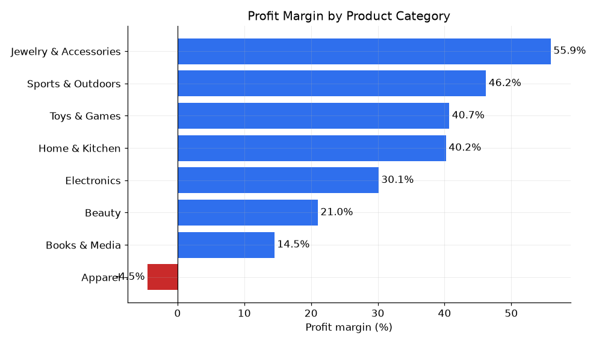
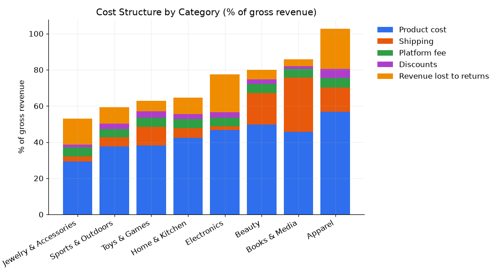
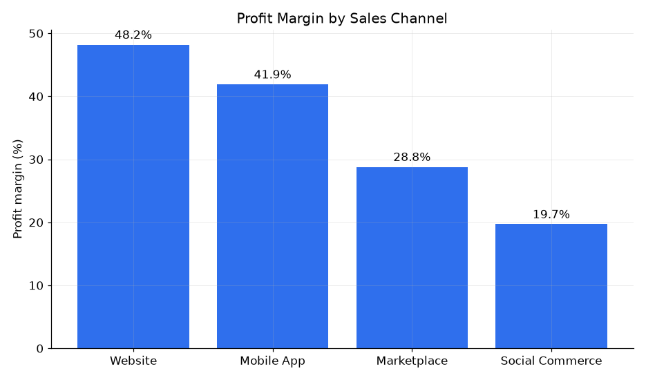
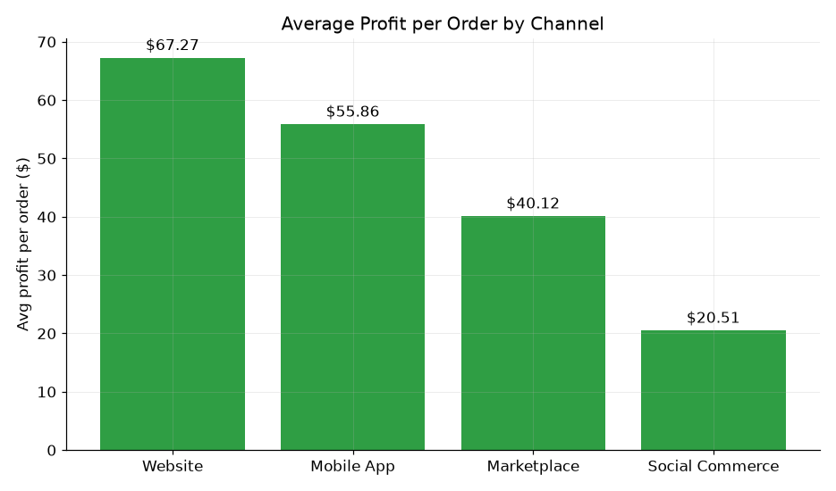
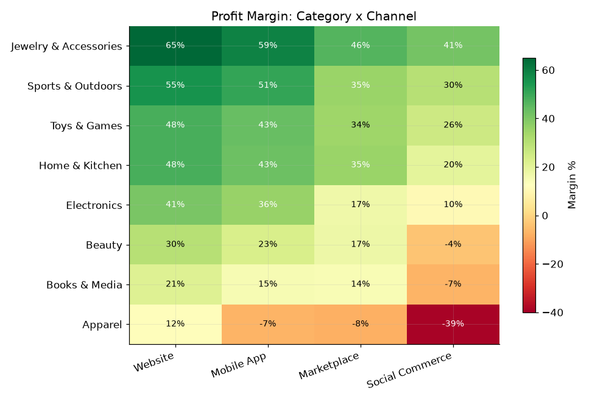
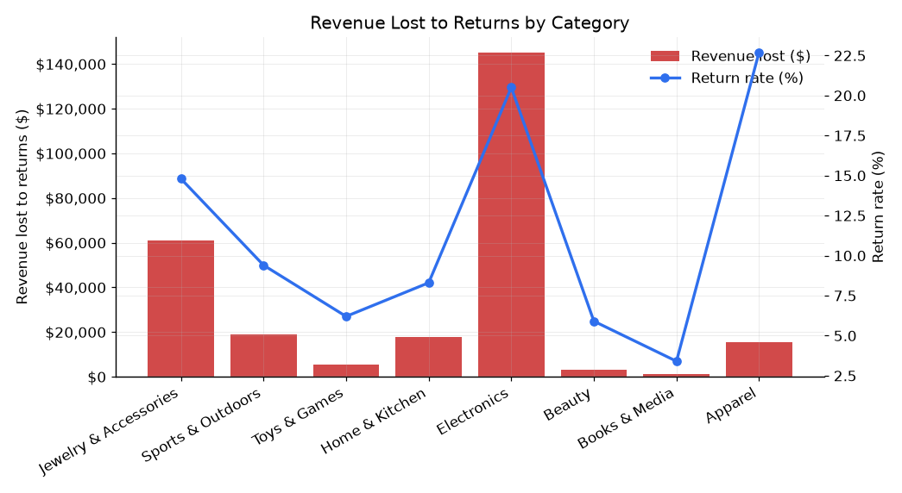
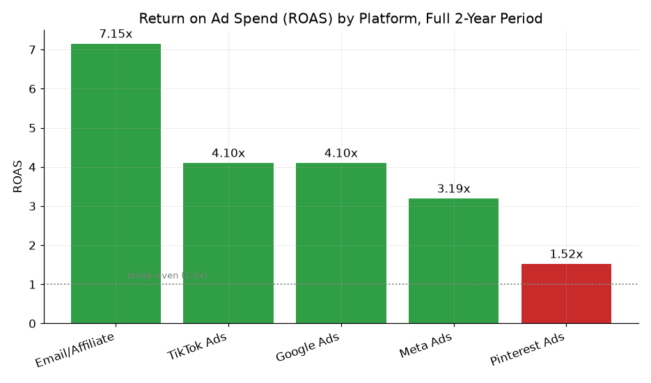
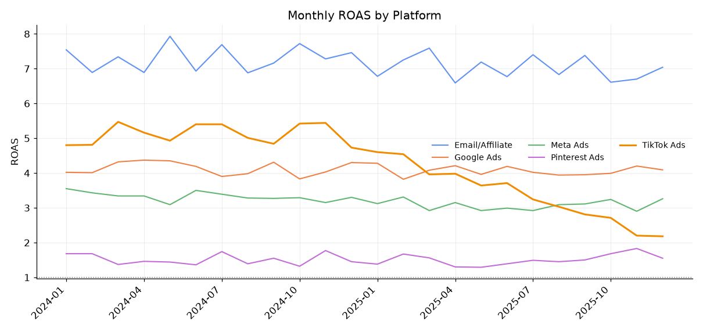
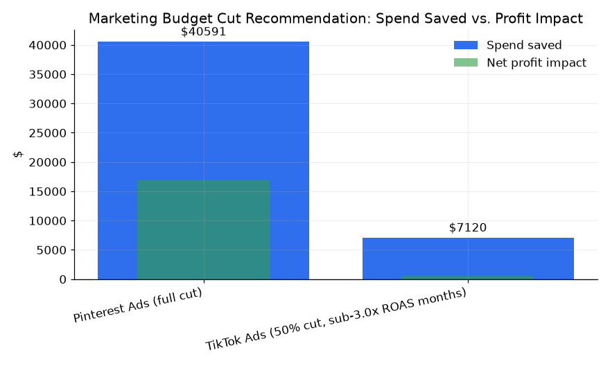

# BrightCart — E-Commerce Profitability Analysis

BrightCart is a direct-to-consumer retailer selling across 8 product categories and 4 sales
channels (Website, Mobile App, Marketplace, Social Commerce). Revenue has grown past $1M over the
last two years, but net margins have been shrinking, and the CEO wants to know which parts of the
business are actually profitable once shipping, returns, platform fees, and marketing spend are
all accounted for — not just which parts generate the most revenue.

This project answers that with three connected datasets: order-level transactions, a product cost
catalog, and monthly marketing spend by platform, analyzed in SQL with a pandas-cleaned Excel
companion workbook on top.

## Dataset

- `data/orders.csv` — 11,203 order lines: product, channel, quantity, price, discount, shipping
  cost, platform fee, and return status/reason.
- `data/products.csv` — 80 SKUs across the 8 categories, with unit cost and list price.
- `data/marketing_spend.csv` — 120 rows (5 platforms × 24 months): spend, impressions, clicks,
  conversions, and attributed revenue.

The raw order data has the kind of mess a real finance export usually has: ~90 duplicate rows,
~70 order lines referencing a product_id that isn't in the catalog (no cost to attach, so they're
excluded from profit analysis rather than guessed at), ~110 missing shipping costs (imputed with
the category median), and a handful of negative discount values from data entry errors (clamped to
zero). All of this is caught and quantified in the audit step before any profitability number is
calculated — see `sql/02_data_quality_checks.sql`.

## Workflow

1. **Load & audit** — schema, null/duplicate checks, orphan-SKU quantification, cost-component
   reconciliation (`sql/01_schema_and_cleaning.sql`, `sql/02_data_quality_checks.sql`).
2. **Category profitability** — revenue, cost, profit, and margin by category, plus a cost-structure
   breakdown (product cost / shipping / fees / discounts / returns as % of gross revenue) that
   explains *why* each category's margin looks the way it does (`sql/03_category_profitability.sql`).
3. **Channel analysis** — margin, AOV, and profit per order by channel, with platform fees isolated,
   plus the category × channel margin matrix (`sql/04_channel_analysis.sql`).
4. **Returns analysis** — return rate and revenue lost to returns by category and channel, plus
   return reasons (`sql/05_return_analysis.sql`).
5. **Marketing ROI** — ROAS, CPA, and CPC by platform, a profit-adjusted "is this platform actually
   worth it" check, and a monthly ROAS trend to catch platforms whose recent performance has
   diverged from their historical average (`sql/06_marketing_roi.sql`).
6. **Budget recommendation** — sizing an actual 20%-of-budget cut against real profit impact, not
   just spend (`sql/07_budget_recommendation.sql`).
7. **Reporting layer** — `analysis/BrightCart_Profitability_Summary.xlsx`: raw data + a
   pandas-cleaned order table with live Excel formulas for every profit calculation, full summary
   tabs, and a one-page Executive Summary with the top 3 recommendations pulled live from the
   underlying tabs (not typed-in numbers).

Every number below came directly from running the `.sql` files against a local SQLite build of the
three CSVs (`sql/load_db.py`) — none of it was estimated by hand, and the Excel workbook's numbers
were cross-checked against the same SQL output.

## Findings

### 1. Category profitability

| Category | Margin | What's driving it |
|---|---|---|
| Jewelry & Accessories | **55.9%** | Low product-cost ratio (29% of gross), low return rate (14.8%) |
| Sports & Outdoors | 46.2% | Balanced cost structure across the board |
| Toys & Games | 40.7% | Low returns (6.2%), moderate everything else |
| Home & Kitchen | 40.2% | Balanced |
| Electronics | 30.1% | High absolute returns ($144,935 lost) but high price points absorb it |
| Beauty | 21.0% | Thin margin despite low returns — high shipping cost as a % of low unit price |
| Books & Media | 14.5% | Thin retail markup (46% product cost) + shipping eats 30% of gross on low-price items |
| **Apparel** | **-4.5%** | **Losing money**: highest product-cost ratio (57%), highest return rate (22.7%), heaviest discounting (34% of orders discounted) |

Apparel is the only category losing money overall, and it's not one thing driving it — it's the
combination of a thin base margin *and* the highest return rate *and* the heaviest discount usage
all landing on the same category at once.




### 2. Channel profitability

| Channel | Margin | Avg profit/order | Platform fee |
|---|---|---|---|
| Website | **48.2%** | $67.27 | 0% |
| Mobile App | 41.9% | $55.86 | 0% |
| Marketplace | 28.8% | $40.12 | 15% |
| Social Commerce | **19.7%** | $20.51 | 8% |

Website and Mobile App (no platform fee) comfortably outperform Marketplace and Social Commerce.
Isolating the fee's effect specifically: Marketplace's margin would be **47.4% instead of 28.8%**
without its 15% take rate — the fee alone accounts for nearly the entire gap to Website. Social
Commerce is worse than the fee alone explains, though (8% fee, but a 20-point margin gap) — its
14.4% return rate (highest of any channel) is doing the rest of the damage.




The category × channel breakdown is where the real story is, though — channel weakness isn't
spread evenly:



**Apparel sold through Social Commerce runs at -39% margin** — the worst cell in the entire
matrix, by a wide margin, and it's the compounding of Apparel's already-thin base economics with
Social Commerce's fee and return rate. Every other category stays profitable on every channel;
this one combination doesn't.

### 3. Returns

Returns cost BrightCart **$267,678 in gross revenue** over the two-year period (11.4% overall
return rate), plus another **$30,227** in shipping/fee/processing costs that were still incurred on
those orders even though the sale reversed.

| Category | Return rate | Revenue lost |
|---|---|---|
| Electronics | 20.5% | **$144,935** |
| Jewelry & Accessories | 14.8% | $61,090 |
| Apparel | 22.7% | $15,453 |

Electronics alone accounts for **54% of all revenue lost to returns**, driven by a mid-pack return
rate (20.5%) at a high price point. Apparel's return rate is actually the *highest* of any category
(22.7%), but its dollar impact is smaller simply because its price points are lower. Return reasons
came out fairly evenly split across the six standard categories (Changed Mind, Not as Described,
Damaged in Transit, Item Defective, Wrong Size/Fit, Found Cheaper Elsewhere all sit within a few
points of each other) — a useful finding in its own right: this isn't a single fixable root cause,
it's a mix of product-fit, logistics, and buyer's-remorse issues that would need separate fixes.



### 4. Marketing ROI

| Platform | ROAS | Verdict |
|---|---|---|
| Email/Affiliate | **7.15x** | Profitable |
| Google Ads | 4.10x | Profitable |
| TikTok Ads | 4.10x (2-yr avg) | Profitable overall, but see below |
| Meta Ads | 3.19x | Profitable |
| **Pinterest Ads** | **1.52x** | **Losing money after ad spend** |

Pinterest's 1.52x ROAS looks positive on paper (revenue > spend), but once BrightCart's actual
product margin is applied to that attributed revenue, Pinterest is the only platform that doesn't
earn back what it costs — it's running at a **-$16,854 net loss** over the two years once margin
is factored in, not just a low-but-positive return.



The full-period average hides something the monthly trend catches:



**TikTok's ROAS has eroded from ~5x through most of 2024 down to 2.18x by December 2025** —
its most recent 3-month ROAS (2.31x) has diverged sharply from its 2-year average (4.10x). A
platform whose efficiency is actively declining while spend keeps rising (seasonal Nov/Dec spend
included) is a very different problem than a platform that's simply always been weak like
Pinterest, and the two need different fixes: cut Pinterest, *rescue or reduce* TikTok.

### 5. If the CEO wants to cut 20% of the marketing budget

Total 2-year marketing spend is **$331,699**; 20% of that is **$66,340**. Two data-backed levers:

| Lever | Spend saved | Net profit impact |
|---|---|---|
| Eliminate Pinterest Ads entirely | $40,591 | **+$16,854** (profit gain) |
| Cut TikTok Ads 50% in its 4 sub-3.0x-ROAS months (Sep–Dec 2025) | $7,120 | +$547 (roughly break-even) |
| **Combined** | **$47,710** | **+$17,401** |

These two moves together reach **72% of the full 20% target**, and — notably — they're **profit-positive**, not a cost: neither dollar of that spend was earning its keep, so cutting it adds to
profit rather than trading it away. Closing the remaining ~$18.6K gap to a full 20% cut would mean
trimming Google Ads, Meta Ads, or Email/Affiliate — all three are solidly profitable, so that last
stretch would start giving up real profit to hit an arbitrary percentage.

**Recommendation: take the ~14%-of-budget cut that's profit-positive rather than force the full
20%.** If the CEO's 20% figure is a hard budget constraint rather than a target proxy for "cut
waste," that's worth surfacing directly — the data doesn't support finding another $18.6K of cuts
without giving up profitable growth.



## Top 3 recommendations (the one-page summary)

The Excel workbook's **Executive Summary** tab has this as a standalone one-pager with the figures
pulled live from the underlying tabs. In short:

1. **Fix or drop Apparel on Social Commerce** — the only channel × category combination running at
   a real loss (-39% margin), driven by that channel's fee stacking on top of Apparel's already
   thin, return-heavy economics.
2. **Cut Pinterest Ads entirely and trim TikTok's weakest recent months** — both moves are
   profit-positive, not a trade-off, and get 72% of the way to a 20% budget cut without giving up
   any spend that's actually working.
3. **Address returns in Electronics and Apparel specifically** — together they account for the
   large majority of the $267,678 lost to returns; a sizing/fit guide for Apparel and tighter
   product-description accuracy for Electronics are the most direct levers given each category's
   top return reason.

## Tech stack and how to reproduce

- **SQL** (`sql/`) — SQLite locally (`python3 sql/load_db.py` builds `brightcart.db` from the three
  CSVs); written close to standard SQL, with `strftime()` for date parts being the main thing that
  would need adjusting for Postgres/MySQL.
- **Pandas** — used both for the synthetic data generation (`src/generate_data.py`) and for the
  cleaning/filtering pass that produces the Excel workbook's "Orders Cleaned" tab (deduplication and
  orphan-SKU removal are row-selection operations Excel can't do live without array-spill functions
  this environment's calculation engine doesn't support — so that part is done in pandas, while the
  actual profit math on the surviving rows stays as live Excel formulas).
- **Excel** (`analysis/BrightCart_Profitability_Summary.xlsx`) — raw data, a cleaned/joined order
  table, and every summary above as live COUNTIFS/SUMIFS/AVERAGEIFS/SUMPRODUCT formulas, plus the
  one-page Executive Summary. This workbook could not be recalculated by the automated LibreOffice
  check in the environment this was built in (it hung even on a trivial one-formula test file, so
  that's an environment limitation, not a defect in the file) — every formula and cross-sheet
  reference was traced by hand and cross-checked against the independent SQL output instead, and
  Excel/Google Sheets/LibreOffice Calc will recalculate it correctly the first time it's opened
  normally, the same way any openpyxl-generated workbook without cached values does.

```bash
cd ecommerce-profitability-analysis
python3 sql/load_db.py                 # builds brightcart.db from the three CSVs
# then run any file in sql/ against brightcart.db with your SQLite client of choice
```

## Project structure

```
ecommerce-profitability-analysis/
├── README.md
├── data/
│   ├── orders.csv
│   ├── products.csv
│   └── marketing_spend.csv
├── src/
│   └── generate_data.py
├── sql/
│   ├── load_db.py
│   ├── 01_schema_and_cleaning.sql
│   ├── 02_data_quality_checks.sql
│   ├── 03_category_profitability.sql
│   ├── 04_channel_analysis.sql
│   ├── 05_return_analysis.sql
│   ├── 06_marketing_roi.sql
│   └── 07_budget_recommendation.sql
└── analysis/
    ├── BrightCart_Profitability_Summary.xlsx
    ├── query_results/          (CSV exports of every query above)
    └── charts/                 (PNG chart previews referenced in this README)
```
