# NYC Traffic Safety Analysis

"The mayor's office wants a data-driven report on traffic safety. Use this data to create a report
with it." That's the brief, more or less verbatim. This project turns a 7-year, ~155,000-row
recreation of NYC's Motor Vehicle Collisions dataset into an actual answer: is the trend improving,
where are crashes concentrated, what causes them, and who's most at risk — with SQL doing the heavy
lifting the brief itself recommends for a dataset this size, a Power BI reporting layer on top, and
an Excel companion workbook.

## About the data

This is a **synthetic recreation** of NYC's real, publicly available "Motor Vehicle Collisions -
Crashes" dataset (data.cityofnewyork.us), not a copy of the real data — this environment didn't have
network access to fetch the real 443MB source file, and downloading + uploading a file that size
wasn't practical either. Instead, `src/generate_data.py` builds a dataset with the **same column
names, the same known quirks, and the same scale** as the real thing:

- Same schema: `BOROUGH`, `ON STREET NAME`, `CONTRIBUTING FACTOR VEHICLE 1/2`,
  `VEHICLE TYPE CODE 1/2`, per-role injury/fatality counts, etc. — matching the real dataset's
  actual column names exactly.
- Same real-world quirks: a large share of crashes have no borough/coordinates because geocoding
  failed; `"Unspecified"` dominates the contributing-factor field because a lot of police reports
  never record a determined cause; vehicle types show up under several different spellings
  ("SEDAN" / "sedan" / "4 dr sedan"; "SUV" / "Station Wagon/Sport Utility Vehicle"); a small number
  of rows have `(0, 0)` coordinates — a known real geocoding-failure artifact in this exact dataset.
- Same shape of real-world pattern: a COVID-era crash-count crash (2020 lockdowns meant far less
  traffic) paired with a **rise** in the fatality rate per crash that year (emptier roads → more
  speeding → the crashes that did happen were more severe) — a genuine, well-documented pattern in
  real NYC crash data, not something made up for this project.

Every technique below — the SQL cleaning, the standardization logic, the trend analysis — is the
real article. The rows themselves are generated, not downloaded.

## Workflow

1. **Data preparation** — schema, duplicate/missing-value/coordinate-glitch checks, date/time
   parsing, and vehicle-type standardization, all in SQL (`sql/01_schema_and_cleaning.sql`,
   `sql/02_data_quality_checks.sql`).
2. **Collision trends** — crashes per year (rising/falling), by borough, top 10
   streets/intersections (`sql/03_collision_trends.sql`).
3. **Contributing factors** — top known causes, and how they differ by borough
   (`sql/04_contributing_factors.sql`).
4. **Injury & fatality analysis** — by borough, by road-user type (pedestrian/cyclist/motorist),
   and over time (`sql/05_injury_fatality_analysis.sql`).
5. **Vehicle types** — most common types, and whether type is linked to more severe outcomes
   (`sql/06_vehicle_types.sql`).
6. **Reporting layer** — a Power BI star schema, DAX measures, and Power Query cleaning steps
   (`powerbi/`), plus an Excel companion workbook with a live-formula demonstration on the most
   recent full year and a one-page Executive Summary for the mayor's office
   (`analysis/NYC_Traffic_Safety_Analysis.xlsx`).

Every number below came from running the `.sql` files against a local SQLite build of the crash CSV
(`sql/load_db.py`) — none of it was estimated by hand.

## Findings

### 1. Are crashes rising or falling?

| Year | Crashes | Fatalities per 1,000 crashes |
|---|---|---|
| 2018 | 27,053 | 4.69 |
| 2019 | 25,536 | 4.35 |
| 2020 | 15,813 | **7.02** |
| 2021 | 20,261 | **6.66** |
| 2022 | 22,759 | 4.57 |
| 2023 | 21,829 | 4.44 |
| 2024 | 20,962 | 4.48 |

**Total crash count is down 22% from 2018 to 2024**, and would look like a clean improving trend on
its own. But that misses the real story: **the fatality rate per crash spiked in 2020-2021**, nearly
60% higher than the surrounding years. Fewer cars on the road during COVID lockdowns meant less
congestion — and less congestion meant higher speeds, so the crashes that did happen were
considerably more severe. Both things are true at once: crashes are down, but 2020-2021 was a more
dangerous period to be on the road *per crash that occurred*, not a safer one. By 2022-2024 the
fatality rate settled back to (and slightly below) pre-pandemic levels alongside the falling crash
count — a genuine, sustained improvement on both fronts in the most recent 3 years.

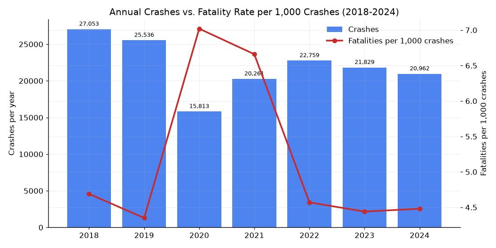
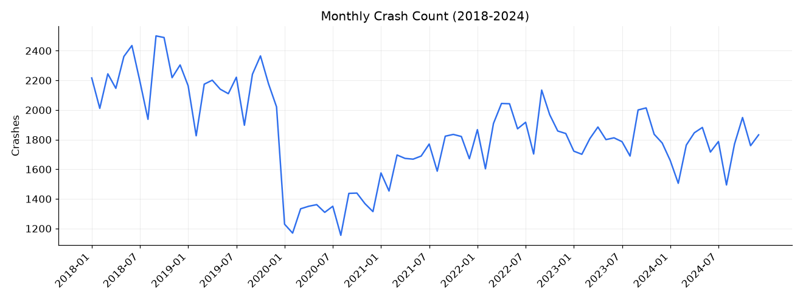

### 2. Most dangerous boroughs and streets

| Borough | Crashes | Killed |
|---|---|---|
| Brooklyn | 41,896 | 216 |
| Queens | 37,696 | 175 |
| Manhattan | 28,489 | 154 |
| Bronx | 25,254 | 120 |
| Staten Island | 7,104 | 44 |

Brooklyn and Queens have the highest raw crash counts (consistent with being the two largest
boroughs by population and land area) — all 10 of the top-crash streets happen to be in Brooklyn,
reflecting both its arterial road layout and its overall crash volume. **Staten Island has the
highest fatality rate per 1,000 crashes (6.19) despite the fewest total crashes** — smaller sample,
but consistent with its elevated speeding rate (see below). ~9% of crashes have no borough recorded
at all (a geocoding gap, not a data-cleaning failure), so these borough totals should be read as "of
crashes we could locate," not literally every crash citywide.

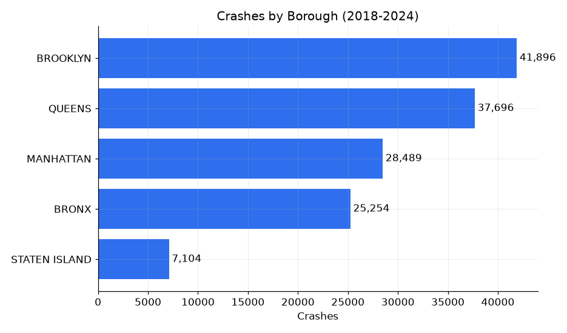
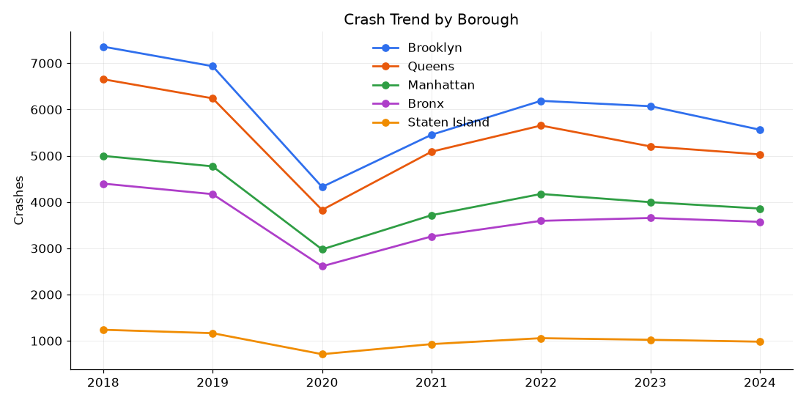
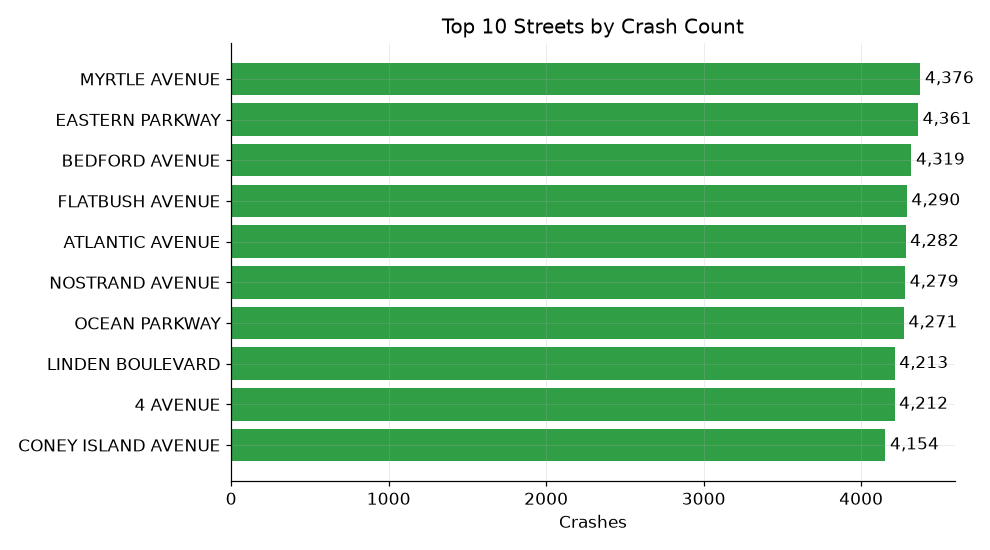

### 3. Leading causes, and how they vary by borough

**30% of all crashes have no recorded contributing factor at all ("Unspecified")** — a genuine
limitation of this kind of police-report data worth stating plainly rather than glossing over. Of
the crashes with a known cause:

| Rank | Contributing factor | Share of known-cause crashes |
|---|---|---|
| 1 | Driver Inattention/Distraction | 22.5% |
| 2 | Failure to Yield Right-of-Way | 10.5% |
| 3 | Unsafe Speed | 10.1% |
| 4 | Following Too Closely | 8.4% |
| 5 | Other Vehicular | 7.4% |

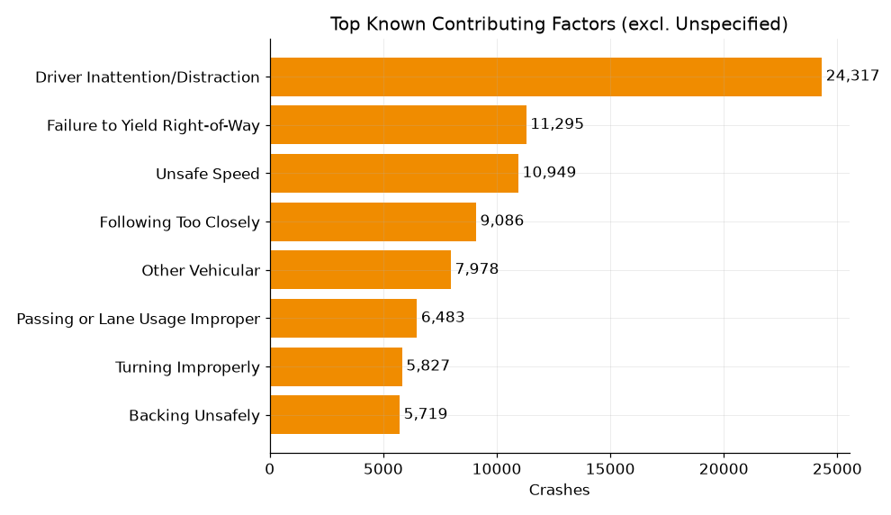

Speeding varies sharply by borough — **exactly the Queens-vs-Manhattan comparison the brief asks
about**: Queens crashes cite Unsafe Speed **10.45%** of the time, vs. Manhattan's **5.34%** — almost
double. Staten Island is even higher (11.26%). This lines up with the two boroughs' road types:
Queens and Staten Island have more wide, higher-speed arterial roads, while Manhattan's dense grid
keeps speeds lower but shifts the problem toward inattention (43.4% of Manhattan's known-cause
crashes, the highest of any borough) and failure-to-yield (20.3%).

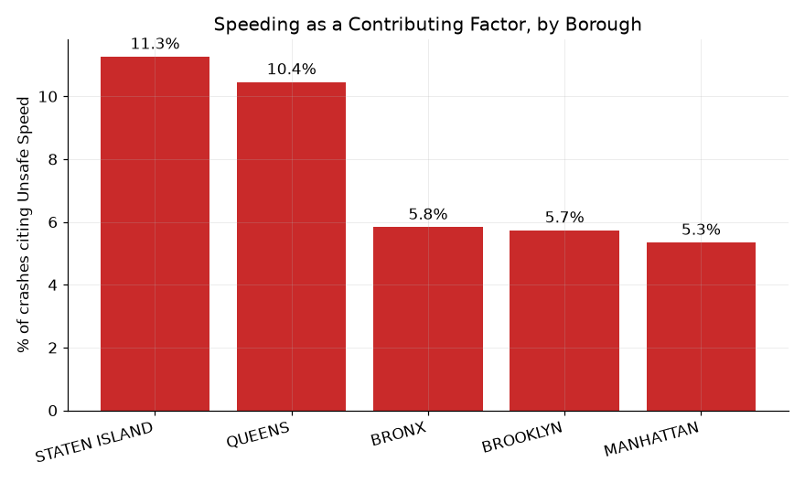

### 4. Who's at highest risk

This is the most important finding in the whole analysis. Raw injury counts make it look like
motorists bear most of the risk — they're 68% of all injuries. **Fatalities tell a very different
story:**

| Road user | Share of all injuries | Share of all fatalities | Fatal when involved |
|---|---|---|---|
| Motorist | 68.0% | 39.8% | 0.82% |
| Pedestrian | 19.9% | **40.3%** | **2.78%** |
| Cyclist | 12.1% | 19.9% | **2.26%** |

**Pedestrians are only 20% of the people injured in crashes, but 40% of the people killed** —
massively overrepresented in fatalities relative to injuries. Put another way: a pedestrian involved
in a crash is **3.4x more likely to die than a motorist** involved in a crash (2.78% vs. 0.82%), and
a cyclist is **2.75x more likely**. Motorists dominate the raw crash-involvement numbers simply
because most crashes only involve vehicle occupants — but when a pedestrian or cyclist *is* involved,
the outcome is disproportionately severe. This is the clearest, most policy-relevant number in the
entire dataset.

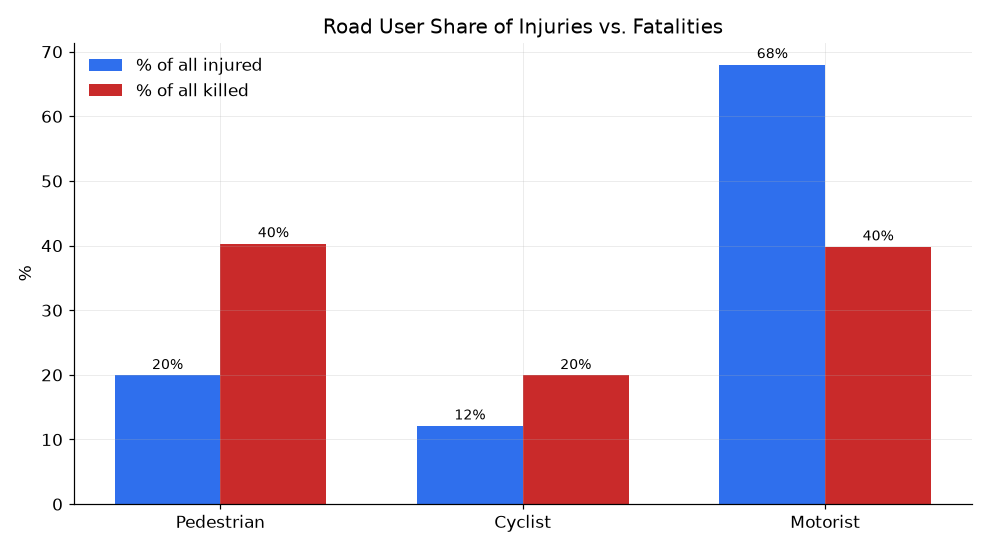
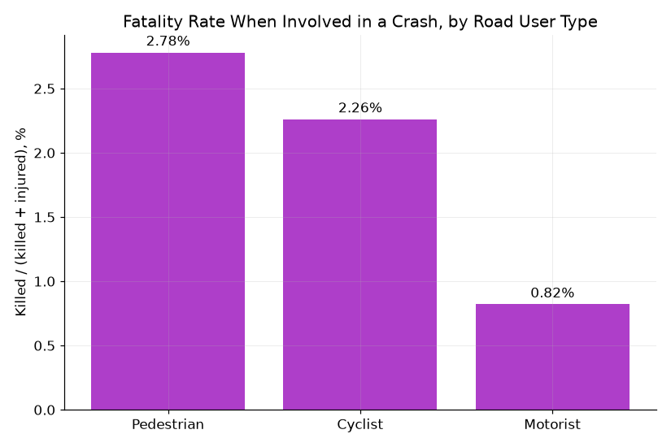
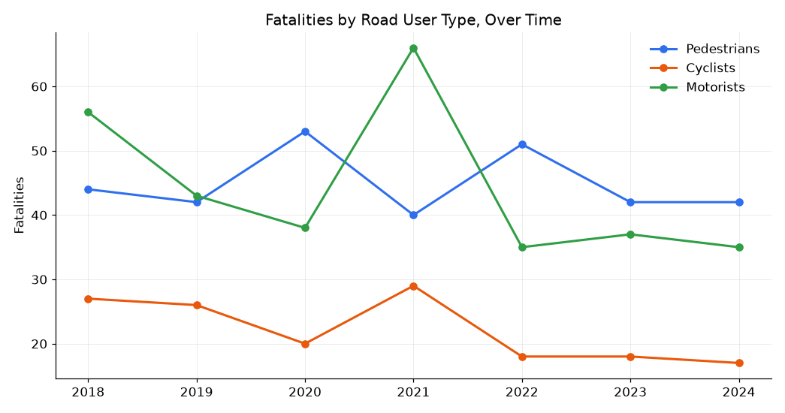

### 5. Vehicle types

Sedans (35.4%) and SUVs (31.1%, after standardizing "SUV"/"Station Wagon/Sport Utility Vehicle"/
"Sport Utility / Station Wagon" into one category) dominate crash involvement simply because they
dominate the vehicle fleet.

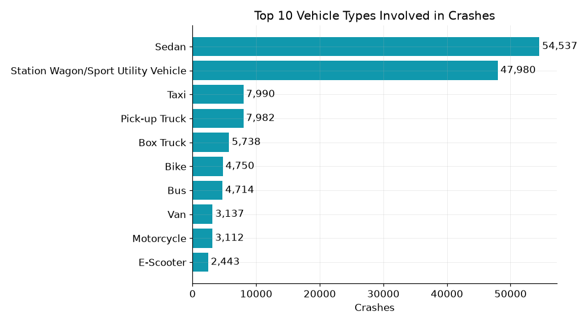

On severity, the differences are **modest** — worth saying plainly rather than overselling a weak
signal. Motorcycles (7.07 fatal crashes per 1,000) and larger vehicles like Box Trucks (6.45) and
Vans (5.42) run somewhat higher than Sedans (5.06) or SUVs (4.84), which lines up with real-world
intuition (less occupant protection for motorcycles; more mass and larger blind spots for trucks/
vans) — but this dataset doesn't control for speed, road type, or other confounders, so treat this
as suggestive rather than confirmed.

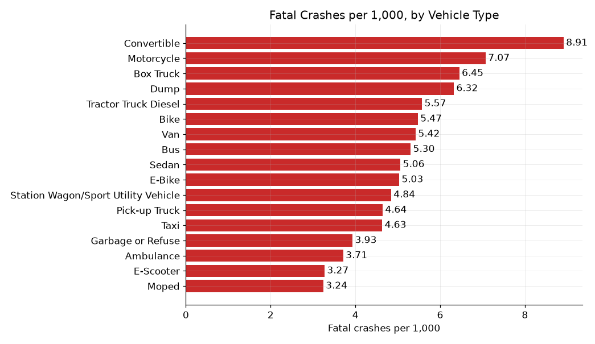

## Recommendations for the mayor's office

1. **Target speed enforcement in Queens and Staten Island specifically.** Speeding is cited in
   roughly double the share of crashes there compared to Manhattan — speed cameras and traffic
   calming on wide arterial roads address a cause that's measurably concentrated in these boroughs,
   not a citywide-uniform problem.
2. **Prioritize pedestrian and cyclist infrastructure over vehicle-occupant-focused measures.**
   Vulnerable road users are dying at 2.75-3.4x the rate of motorists once involved in a crash.
   Protected bike lanes, pedestrian islands, and intersection daylighting address exactly this
   gap — general traffic-safety measures aimed at reducing crashes overall won't fix a problem
   that's specifically about *who* survives the crashes that do happen.
3. **Launch a distracted-driving awareness campaign** (the single largest identified cause), **and
   push for better cause reporting** — 30% of all crashes have no recorded cause, which is a real
   limitation on how much any analysis, this one included, can say about what's actually driving
   the numbers.

The Excel workbook's **Executive Summary** tab has this as a standalone one-pager with the figures
pulled live from the underlying tabs, ready to hand off.

## Tech stack and how to reproduce

- **SQL** (`sql/`) — SQLite locally (`python3 sql/load_db.py` builds `nyc_crashes.db` from the
  crash CSV); this is exactly the "put it in a database" step the brief itself recommends at this
  scale. Written close to standard SQL, with `strftime()`/`substr()`-based date parsing being the
  main things that would need adjusting for Postgres/MySQL.
- **Power BI** (`powerbi/`) — star-schema data model, Power Query cleaning steps (including the
  vehicle-type standardization, kept identical to the SQL logic so both layers agree), and the full
  DAX measure list. No `.pbix` file — Power BI Desktop is Windows-only and wasn't available in this
  environment — but everything needed to rebuild the report is documented, and static recreations of
  each page's core visual are the PNGs referenced above.
- **Excel** (`analysis/NYC_Traffic_Safety_Analysis.xlsx`) — deliberately scoped rather than forcing
  all ~155,000 rows into a spreadsheet: a full live-formula demonstration (dedup flag, vehicle-type
  standardization, cause-of-mismatch checks) on 2024 alone (~21,000 rows — still a large sample, not
  a toy), plus reference summary tables for the full 2018-2024 period sourced from the verified SQL
  output and clearly labeled as such (light-gray fill) rather than presented as a live recalculation
  of the whole dataset. That split mirrors the brief's own advice: use the database for the heavy
  lifting, use Excel where its scale actually fits.

```bash
cd nyc-traffic-safety-analysis
python3 sql/load_db.py                 # builds nyc_crashes.db from the crash CSV
# then run any file in sql/ against nyc_crashes.db with your SQLite client of choice
```

## Project structure

```
nyc-traffic-safety-analysis/
├── README.md
├── data/
│   └── Motor_Vehicle_Collisions_Crashes.csv
├── src/
│   └── generate_data.py
├── sql/
│   ├── load_db.py
│   ├── 01_schema_and_cleaning.sql
│   ├── 02_data_quality_checks.sql
│   ├── 03_collision_trends.sql
│   ├── 04_contributing_factors.sql
│   ├── 05_injury_fatality_analysis.sql
│   └── 06_vehicle_types.sql
├── powerbi/
│   ├── data_model.md
│   ├── power_query_steps.md
│   └── dax_measures.txt
└── analysis/
    ├── NYC_Traffic_Safety_Analysis.xlsx
    ├── query_results/          (CSV exports of every query above)
    └── charts/                 (PNG chart previews referenced in this README)
```
